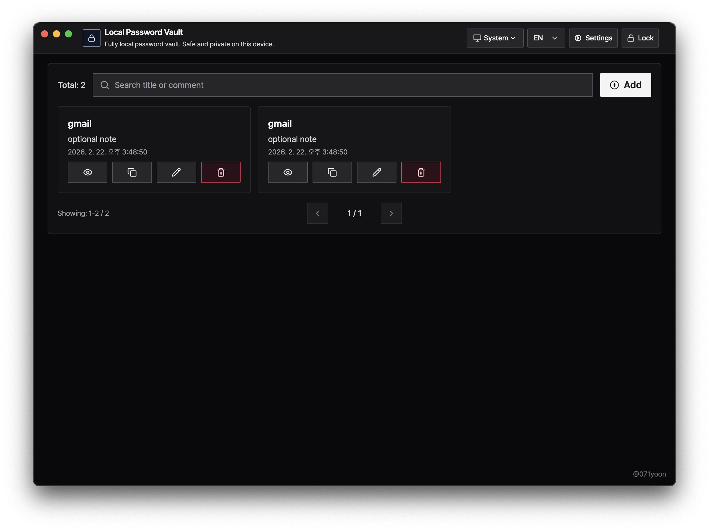

# Local Password Vault



Local Password Vault is a desktop app for managing credentials locally with client-side encryption. It is built with Electron and React, with no backend service or cloud sync required.

## What it does
- Set and manage a master password.
- Lock and unlock the vault manually.
- Create, edit, delete, search, and page through password entries.
- Reveal or copy passwords securely from the workspace.
- Generate strong passwords.
- Switch language (English/Korean) and theme (light/dark/system).
- Import/export vault data with password-based re-encryption.
- Reset vault data.

## Security model
- Master key is derived with `scrypt` from the user password and a random salt.
- Each password entry is encrypted with `AES-256-GCM`.
- Data is stored only in the local Electron `userData` location as `vault.json`.
- Export/Import:
  - Export writes the current encrypted vault payload to JSON.
  - Import requires the source vault password, validates it against the source master hash, decrypts entries, then re-encrypts them with the current app master key before saving.

## Repository Scripts
```bash
yarn install
yarn dev       # start development
yarn build     # build app bundles
yarn package   # create distributable packages
```

## Distribution
- macOS: distribute `.dmg` / `.zip`
- Windows: generate `.exe` installer on Windows environment

## Notes
- No backend services are used for vault operations.
- All credentials remain stored locally only unless the user explicitly exports the JSON file.
